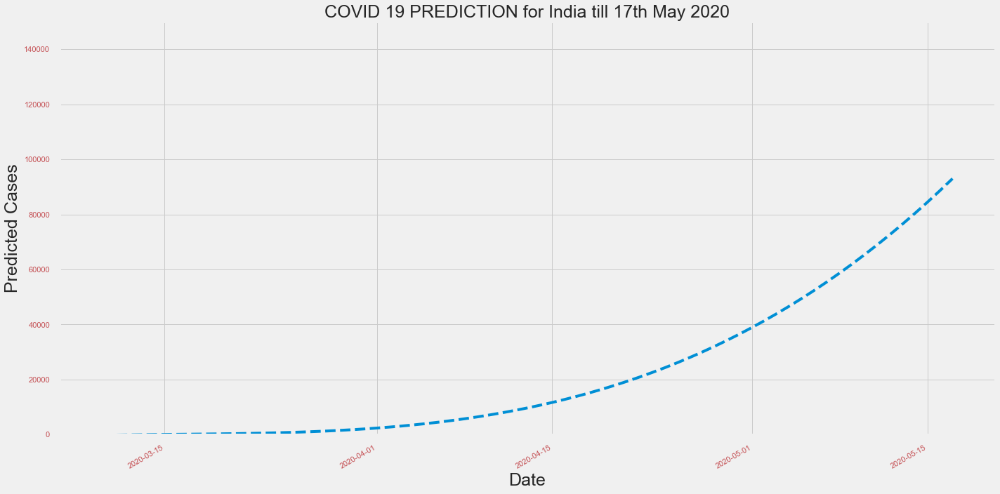

# Covid19-Confirmed-cases-prediction
System predicts total number of confirmed COVID-19 cases in the India for next 7 days.

#### Model used is 3rd degree polynomial regression, model is trained on dataset provided by John Hopkins University. Link for dataset: https://data.humdata.org/dataset/novel-coronavirus-2019-ncov-cases 

#### Graph on total number of confirmed COVID-19 cases in various countries:

#### Graph on rise of confirmed COVID-19 cases in the India till 17th May 2020: 

#### Graph on actual Vs predicted confirmed COVID-19 cases in the India till 17th May 2020:

#### Graph on total number of confirmed COVID-19 cases in the India till 16th May 2020 predicted by the model:

#### Prediction Results:
        Predicted_Cases
  Date  
  
2020-05-10            65496

2020-05-11            69034

2020-05-12            72699

2020-05-13            76494

2020-05-14            80420

2020-05-15            84480

2020-05-16            88675

2020-05-17            93009
